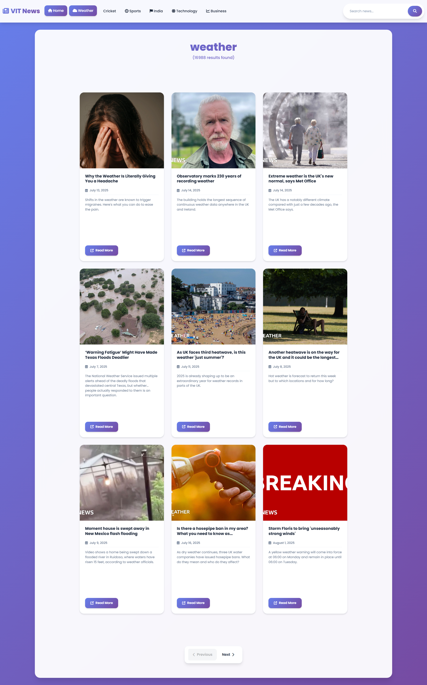

# VIT News App 📰

A modern, responsive news application built with Node.js, Express, and vanilla JavaScript. This application provides real-time news updates from various categories using the News API.



## ✨ Features

- **Real-time News**: Get the latest news from around the world
- **Category-based Navigation**: Browse news by categories like Technology, Sports, Business, etc.
- **Search Functionality**: Search for specific news topics
- **Responsive Design**: Beautiful, modern UI that works on all devices
- **Pagination**: Navigate through multiple pages of news articles
- **Modern UI/UX**: Glass morphism design with smooth animations
- **Error Handling**: Graceful error handling and user feedback

## 🚀 Live Demo

The application is designed to be deployed and accessible via web browsers.

## 🛠️ Tech Stack

- **Backend**: Node.js, Express.js
- **Frontend**: HTML5, CSS3, Vanilla JavaScript
- **Styling**: Bootstrap 5, Custom CSS with Glass Morphism
- **Icons**: Font Awesome
- **API**: News API (newsapi.org)
- **Package Manager**: npm

## 📋 Prerequisites

Before running this application, make sure you have:

- Node.js (v14 or higher)
- npm (Node Package Manager)
- A News API key from [newsapi.org](https://newsapi.org/)

## 🔧 Installation

1. **Clone the repository**
   ```bash
   git clone <repository-url>
   cd Capstone-News-App
   ```

2. **Install dependencies**
   ```bash
   npm install
   ```

3. **Environment Setup**
   Create a `.env` file in the root directory and add your News API key:
   ```env
   NEWS_API_KEY=your_news_api_key_here
   PORT=3000
   ```

4. **Get News API Key**
   - Visit [newsapi.org](https://newsapi.org/)
   - Sign up for a free account
   - Get your API key from the dashboard
   - Add it to your `.env` file

## 🚀 Running the Application

### Development Mode
```bash
npm run dev
```

### Production Mode
```bash
npm start
```

The application will be available at `http://localhost:3000`

## 📱 Usage

### Navigation
- **Home**: View all news articles
- **Weather**: Weather-related news
- **Cricket**: Cricket news and updates
- **Sports**: General sports news
- **India**: News from India
- **Technology**: Tech industry news
- **Business**: Business and financial news

### Search
- Use the search bar in the navigation to find specific news topics
- Enter keywords and press Enter or click the search button

### Pagination
- Navigate through multiple pages using the Previous/Next buttons
- Each page displays 9 articles

## 🎨 Features in Detail

### Modern UI Design
- Glass morphism effects with backdrop blur
- Smooth animations and transitions
- Responsive grid layout
- Beautiful gradient backgrounds
- Custom scrollbars

### News Cards
- Image thumbnails for each article
- Article title and description
- Publication date
- Direct link to full article
- Hover effects and animations

### Error Handling
- Graceful handling of API errors
- User-friendly error messages
- Fallback images for missing article images
- Network error recovery

## 📁 Project Structure

```
Capstone-News-App/
├── server.js          # Express server and API routes
├── index.html         # Main application interface
├── package.json       # Project dependencies and scripts
├── .env              # Environment variables (create this)
├── .gitignore        # Git ignore rules
├── README.md         # Project documentation
└── landing-page.png  # Application screenshot
```

## 🔌 API Endpoints

- `GET /` - Serves the main application
- `GET /api` - News API proxy endpoint
  - Query parameters:
    - `q`: Search query
    - `pageSize`: Number of articles per page (default: 9)
    - `page`: Page number

## 🎯 Key Features

### Responsive Design
- Mobile-first approach
- Adaptive grid layouts
- Touch-friendly navigation
- Optimized for all screen sizes

### Performance
- Efficient API calls
- Image optimization
- Minimal dependencies
- Fast loading times

### User Experience
- Intuitive navigation
- Clear visual hierarchy
- Smooth animations
- Loading states and feedback

## 🛡️ Security

- Environment variables for API keys
- Input validation
- Error handling without exposing sensitive data
- Secure API proxy implementation

## 🔄 Development

### Available Scripts
- `npm start`: Start the production server
- `npm run dev`: Start the development server with nodemon

### Adding New Features
1. Fork the repository
2. Create a feature branch
3. Make your changes
4. Test thoroughly
5. Submit a pull request

## 📝 Environment Variables

| Variable | Description | Required |
|----------|-------------|----------|
| `NEWS_API_KEY` | Your News API key | Yes |
| `PORT` | Server port (default: 3000) | No |

## 🤝 Contributing

1. Fork the project
2. Create your feature branch (`git checkout -b feature/AmazingFeature`)
3. Commit your changes (`git commit -m 'Add some AmazingFeature'`)
4. Push to the branch (`git push origin feature/AmazingFeature`)
5. Open a Pull Request

## 📄 License

This project is open source and available under the [MIT License](LICENSE).

## 🙏 Acknowledgments

- [News API](https://newsapi.org/) for providing the news data
- [Bootstrap](https://getbootstrap.com/) for the responsive framework
- [Font Awesome](https://fontawesome.com/) for the icons
- [Google Fonts](https://fonts.google.com/) for the typography

## 📞 Support

If you encounter any issues or have questions:

1. Check the [Issues](https://github.com/yourusername/Capstone-News-App/issues) page
2. Create a new issue with detailed information
3. Contact the development team

---

**Made with ❤️ for VIT University**
